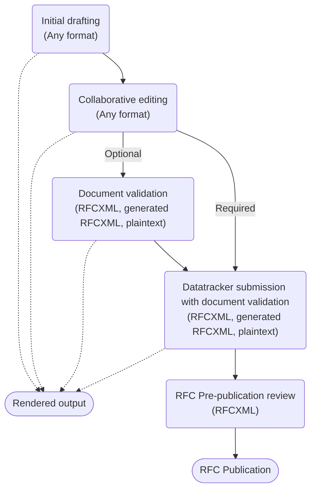

# Making the right choice 

The IETF does not provide an authoring toolchain and does not recommend a specific authoring format, you will need to choose what works best for you. Writing Internet-Drafts is complex and time consuming and you can make that much easier by basing your choice on what markup languages and document editing tools you are familiar with, and how you intend to work.  

## Checklist

1. If you know XML reasonably well, have access to a fully-featured XML editor, and will be collaborating with people in the same position then you should be [Drafting in RFCXML](/drafting-in-xml).  RFCXML is supported end-to-end in the authoring process.

1. If not then you should be [Drafting in Markdown](/drafting-in-markdown).  Markdown is not supported end-to-end but the Markdown toolchains will generate RFCXML when required, normally hiding that complexity.

1. Drafting in any other format is not recommended for new authors.

# How your choice fits into the process
The diagram below shows the different formats supported at each stage of the authoring process.  Some of these stages only support RFCXML and plaintext, but if you are using Markdown then that should not be a problem as the toolchain will generate the RFCXML for you.

- **Initial drafting** 
As explained, there are multiple formats for initial drafting but a careful choice is needed.  New authors often report that they used a format and tool recommended by a fellow author and then later had to put in significant effort to convert it into something they could use more productively. 

- **Collaborative editing**
It is common for a group of authors to work on an I-D and so it is important to consider if all of your co-authors can work with your chosen format and have access to and familiarity with the same tools. Additionally, you need to consider if your I-Ds will be worked on using an integrated issue tracker and source control system such as GitHub.  For more details see [Collaborative editing](/collaborative-editing).

- **Document validation** 
Validation is an important step for a document to ensure that it is correctly formatted and for it to successfully pass the next steps of submission as an Internet-Draft or output rendering.  For more details, see [Document validation](/document-validation).

- **Rendered output**
It is common for authors to render their documents into a easily read format such as PDF, HTML or plaintext.  For more details see [Rendering and converting](/rendering-and-converting).

- **Datatracker submission with document validation**
When you are ready to share your I-D you need to submit it to the Datatracker at which point it will be automatically validated.  Datatracker only accepts I-Ds in RFCXML or plaintext format.  For more details see [Submitting your Internet-Draft](/submitting-your-internet-draft).

- **RFC Pre-publication review**
If your document is chosen to become an RFC (each [RFC Stream](https://rfc-editor.org/info/rfc8729) has a different process for this) then it will need to go through the [AUTH48 pre-publication review process](https://www.rfc-editor.org/pubprocess/auth48/). At this stage you will need to work with RFCXML to address any issues raised by the editors in order for the RFC to be published.

- **RFC Publication**
The canonical format for published RFCs is RFCXML and the other published formats, PDF, HTML and plain text, are derived from this RFCXML. The published RFCXML looks quite different from Internet-Draft RFCXML as it has been passed through the 'prep' tool which makes it work better as a standalone document. 

# Full list of authoring formats

The following authoring formats are in use by the IETF community, though some by only a handful of people:

* **RFCXML**.  This is the most popular choice as RFCXML is the markup language used for published RFCs and can be used end-to-end throughout the authoring process. However, RFCXML is also the most complex and best suits an author or group of co-authors who are very familiar with XML and who all have access to XML editing tools.  See [Drafting in XML](/drafting-in-xml) for more details.
* **Markdown**.  This is the next most popular choice as Markdown is a simplified text markup language, used with one of the tools that converts Markdown to RFCXML.  See [Drafting in Markdown](/drafting-in-markdown) for more details.
* **Other markup languages**.  If you are very familiar with one of the less well known text markup languages and their normal editors, for example LaTeX, nroff or Org Mode in Emacs, then this may be a good choice for you.  A number of these markup languages are supported by tools that can convert your text to either RFCXML or plaintext I-D format, though they may not be as well maintained or fully featured as the Markdown tools.  See [Drafting in other markup languages](/drafting-in-other-markup-languages) for more details.
* **Plain text**.  Plaintext documents are still accepted for I-Ds submission some people either directly create plaintext documents in a text editor, or author in a markup language and generating the plaintext from that.  Drafting in plaintext requires the author to manually provide lots of content that is automatically generated when using a markup language.
*  **Word processors**.  Finally, there are a couple of tools that support word processors such as Microsoft Word, converting their output to RFCXML. See [Drafting in word processors](/drafting-in-word-processors) for more details.

