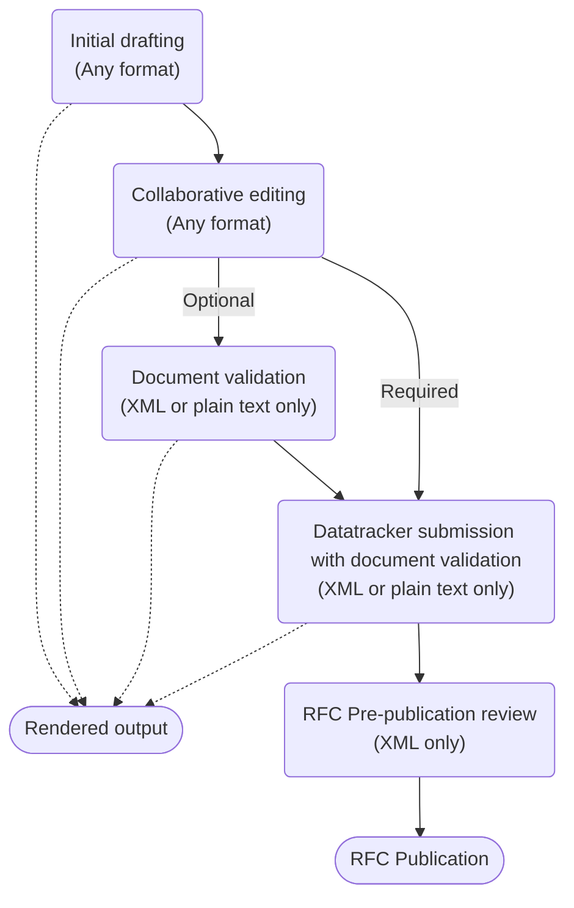

Writing Internet-Drafts is complex and time consuming and careful choice of authoring format and authoring tools can make this task much easier.

## Understanding your options
Your choice of format and tools is likely to depend on what markup languages and document editing tools you are familiar with, and how you intend to work.  Your options are:
1. **RFCXML**.  This is the most popular choice as RFCXML is the markup language used for published RFCs and can be used end-to-end throughout the authoring process. However, RFCXML is also the most complex and best suits an author or group of co-authors who are very familiar with XML and who all have access to XML editing tools. Ideally these XML tools will support collaborative editing (more below).
1. **Markdown**.  This is the next most popular choice as Markdown is a simplified text markup language, used with one of the tools that converts Markdown to RFCXML. 
1. **Other markup languages**.  If you are very familiar with one of the less well known text markup languages and their normal editors, for example LaTeX, nroff or Org Mode in Emacs, then this may be a good choice for you.  A number of these markup languages are supported by tools that can convert your text to either RFCXML or plain text I-D format, though they may not be as well maintained or fully featured as the Markdown tools.
1. **Plain text**.  Plain text documents are still accepted for I-Ds submission and many people work with plain text in one of two ways:
    1. Directly by creating plain text documents in a text editor.
    1. Indirectly by authoring in a markup language and generating the plain text from that.
  1.  Finally, there are a couple of tools that support WYSIWYG editors such as Microsoft Word, converting their output to RFCXML.

## The authoring stages and different formats and tools
To help with your choice, the diagram below deconstructs the authoring process into stages to show how the different formats and tools come in:

- **Initial drafting** 
At this stage, you have all the options above though we recommend reading through all the stages below before you make a decision. New authors often report that they used a format and tool recommended by a fellow author and then later had to put in significant effort to convert it into something they could use more productively.

- **Collaborative editing**
It is common for a group of authors to work on an I-D and so it is important to consider if all of your co-authors can work with your chosen format and have access to and familiarity with the same tools. Additionally, you need to consider if your I-Ds will be worked on using an integrated issue tracker and source control system such as GitHub. 

- **Document validation** 
Validation is an important step for a document to ensure that it is correctly formatted and for it to successfully pass the next steps of submission as an Internet-Draft or output rendering, though many authors rely on the submission process to validate their I-D. The two supported formats for document validation tools are RFCXML and plain text.  If you have used a different format then you will need to ensure it is supported by a tool that can convert it into either plain text or XML for validation.

- **Rendered output**
It is common for authors to render their documents into a easily read format such as PDF, HTML or plain text.

- **Datatracker submission with document validation**
Datatracker only accepts documents in XML or plain text, not in any lightweight text markup language such as Markdown. All drafts are automatically validated as part of the submission process and so must be submitted as either RFCXML or plain text. If you have used a different format for authoring then you will need to ensure that it is supported by a tool that can convert it into either plain text or XML for submission.

- **RFC Pre-publication review**
If your document is chosen to become an RFC then it will need to go through the [AUTH48 pre-publication review process](https://www.rfc-editor.org/pubprocess/auth48/), which uses XML only.  If up to this point you have used plain text or a markup language that is converted into plain text for validation and submission, then the [id2xml] tool will be used to convert it into XML, which may not produce an identical looking result. At this stage you will need to work with XML to address any issues raised by the editors in order for the RFC to be published.

- **RFC Publication**
The canonical format for published RFCs is XML and the other published formats, PDF, HTML and plain text, are derived from this XML. The published XML differs from Internet-Draft XML as it has been passed through the 'prep' tool which makes it work better as a standalone document. 

## Running the tools
Be aware that some tools only work in specific editors, some only work from the command line and some require unusual runtimes to be installed to suport them. If you are not comfortable with installing and running command line tools then there are options that make this easier.
