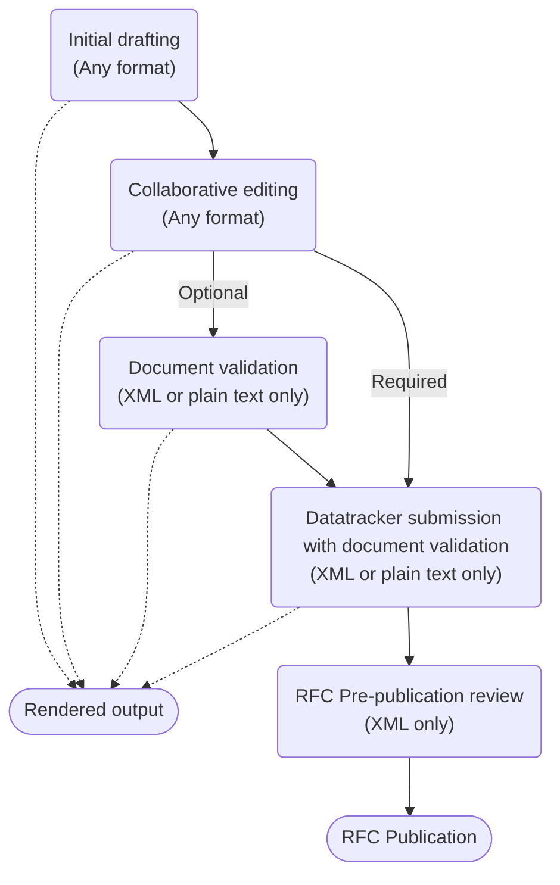

# Welcome to the Internet-Draft authors resource site

> **!! THIS SITE IS STILL UNDER CONSTRUCTION AND THE INFORMATION ON IT SHOULD NOT BE TRUSTED UNTIL IT GOES LIVE !!**
{.is-warning}

This site is the central resource site for authors of an Internet-Draft (I-D), with information on how to write an I-D and the tools available to support this. 

> If you have been redirected here from **tools.ietf.org** then that site has been decommissioned.  The features available at that site have been replaced as follows:
>*  The interactive tools are now at [https://author-tools.ietf.org](https://author-tools.ietf.org)
>* The catalog of tools is now at [Tools catalog](/tools-catalog)
>* The xml2rfc vocabulary documentation is now at [RFCXML Vocabulary](/rfcxml-vocabulary)
>* The repositories for the various tools are now in the [ietf-tools organisation on GitHub](https://github.com/ietf-tools)
{.is-info}

# Overview of the authoring process
The diagram below deconstructs the authoring process into stages and shows how the different formats supported at each stage:

- **Initial drafting** 
At this stage, you have all the options above though we recommend reading through all the stages below before you make a decision. New authors often report that they used a format and tool recommended by a fellow author and then later had to put in significant effort to convert it into something they could use more productively.  For more details see [Choosing your format and tools](/choosing-your-tools).

- **Collaborative editing**
It is common for a group of authors to work on an I-D and so it is important to consider if all of your co-authors can work with your chosen format and have access to and familiarity with the same tools. Additionally, you need to consider if your I-Ds will be worked on using an integrated issue tracker and source control system such as GitHub.  For more details see [Collaborative editing](/collaborative-editing).

- **Document validation** 
Validation is an important step for a document to ensure that it is correctly formatted and for it to successfully pass the next steps of submission as an Internet-Draft or output rendering, though many authors rely on the submission process to validate their I-D. The two supported formats for document validation tools are RFCXML and plain text.  If you have used a different format then you will need to ensure it is supported by a tool that can convert it into either plain text or XML for validation.  For more details, see [Document validation](/document-validation).

- **Rendered output**
It is common for authors to render their documents into a easily read format such as PDF, HTML or plain text.  For more details see [Rendering and converting](/rendering-and-converting).

- **Datatracker submission with document validation**
Datatracker only accepts documents in XML or plain text, not in any lightweight text markup language such as Markdown. All drafts are automatically validated as part of the submission process and so must be submitted as either RFCXML or plain text. If you have used a different format for authoring then you will need to ensure that it is supported by a tool that can convert it into either plain text or XML for submission.

- **RFC Pre-publication review**
If your document is chosen to become an RFC then it will need to go through the [AUTH48 pre-publication review process](https://www.rfc-editor.org/pubprocess/auth48/), which uses XML only.  If up to this point you have used plain text or a markup language that is converted into plain text for validation and submission, then the [id2xml] tool will be used to convert it into XML, which may not produce an identical looking result. At this stage you will need to work with XML to address any issues raised by the editors in order for the RFC to be published.

- **RFC Publication**
The canonical format for published RFCs is XML and the other published formats, PDF, HTML and plain text, are derived from this XML. The published XML differs from Internet-Draft XML as it has been passed through the 'prep' tool which makes it work better as a standalone document. 

# Limitations of this site
This site does not currently include the [Guidelines for I-D authors](https://www.ietf.org/standards/ids/guidelines/) though it is expected that this content will migrate here soon.

This site does not cover the IETF [standards development process](https://www.ietf.org/standards/process/) or the RFC publication process.

# Contributing to this site
The content for this site is available in [GitHub](https://github.com/ietf-authors/authors.ietf.org) and we welcome pull requests proposing changes from the community.

