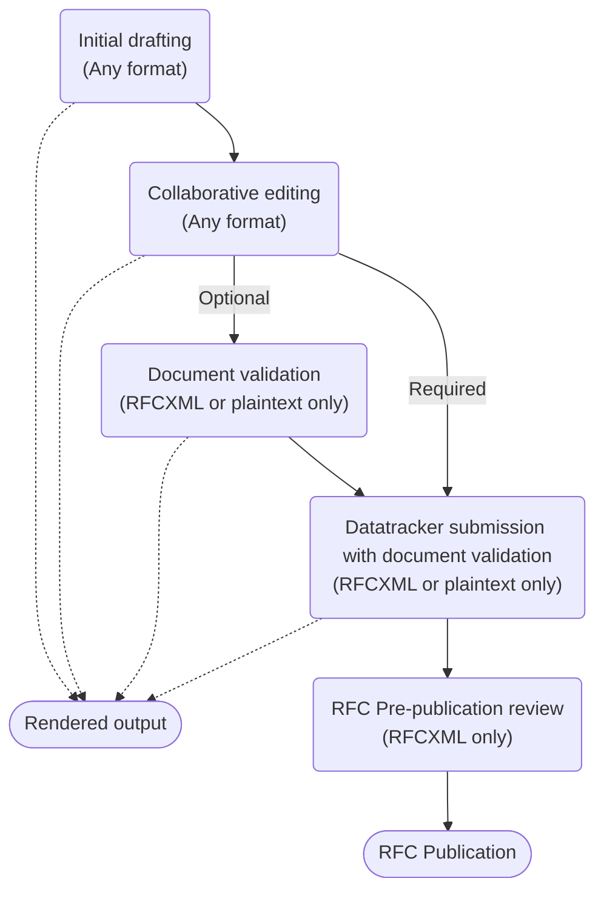

> **!! THIS SITE IS STILL UNDER CONSTRUCTION AND THE INFORMATION ON IT SHOULD NOT BE TRUSTED UNTIL IT GOES LIVE !!**
{.is-warning}

# Welcome to the Internet-Draft authors resource site

This site is the central resource site for authors of an Internet-Draft (I-D), with information on how to write an I-D and the tools available to support this. If you are new to authoring then start with the introduction and overview below, or if you are more familiar then the main menu lists multiple individual topics.

> If you have been redirected here from **tools.ietf.org** then that site has been decommissioned.  The features available at that site have been replaced as follows:
>*  The interactive tools are now at [https://author-tools.ietf.org](https://author-tools.ietf.org)
>* The catalog of tools is now at [Tools catalog](/tools-catalog)
>* The xml2rfc vocabulary documentation is now at [RFCXML Vocabulary](/rfcxml-vocabulary)
>* The repositories for the various tools are now in the [ietf-tools organisation on GitHub](https://github.com/ietf-tools).
{.is-info}

# Introducing Internet-Drafts
Internet-Drafts (I-Ds) are the basic work items of the IETF. They are the primary inputs into what may eventually be published as a Request for Comment (RFC).

Internet-Drafts are used by all of the [RFC Streams](https://rfc-editor.org/info/rfc8729). Unless otherwise indicated, the information on this site applies to all streams.

Internet-Drafts are prepared by people acting in possibly several roles, such as an author or an editor. The term "author" is used here, but the information applies to people acting in any role.

# Overview of the authoring process
The diagram below deconstructs the authoring process into stages and shows the different formats supported at each stage:

- **Initial drafting** 
At this stage, you have all the options above though we recommend reading through all the stages below before you make a decision. New authors often report that they used a format and tool recommended by a fellow author and then later had to put in significant effort to convert it into something they could use more productively.  For more details see [Choosing your format and tools](/choosing-your-tools).

- **Collaborative editing**
It is common for a group of authors to work on an I-D and so it is important to consider if all of your co-authors can work with your chosen format and have access to and familiarity with the same tools. Additionally, you need to consider if your I-Ds will be worked on using an integrated issue tracker and source control system such as GitHub.  For more details see [Collaborative editing](/collaborative-editing).

- **Document validation** 
Validation is an important step for a document to ensure that it is correctly formatted and for it to successfully pass the next steps of submission as an Internet-Draft or output rendering, though many authors rely on the submission process to validate their I-D.  For more details, see [Document validation](/document-validation).

- **Rendered output**
It is common for authors to render their documents into a easily read format such as PDF, HTML or plaintext.  For more details see [Rendering and converting](/rendering-and-converting).

- **Datatracker submission with document validation**
When you are ready to share your I-D you need to submit it to the Datatracker at which point it will be automatically validated.  Datatracker only accepts I-Ds in RFCXML or plaintext format.  For more details see [Submitting your Internet-Draft](/submitting-your-internet-draft).

- **RFC Pre-publication review**
If your document is chosen to become an RFC then it will need to go through the [AUTH48 pre-publication review process](https://www.rfc-editor.org/pubprocess/auth48/), which uses RFCXML only.  If up to this point you have used plaintext or a markup language that is converted into plaintext for validation and submission, then the [id2xml](https://github.com/ietf-tools/id2xml) tool will be used to convert it into RFCXML, which may not produce an identical looking result. At this stage you will need to work with RFCXML to address any issues raised by the editors in order for the RFC to be published.

- **RFC Publication**
The canonical format for published RFCs is RFCXML and the other published formats, PDF, HTML and plain text, are derived from this RFCXML. The published RFCXML looks quite different from Internet-Draft RFCXML as it has been passed through the 'prep' tool which makes it work better as a standalone document. 

# Limitations of this site
This site does not cover the IETF [standards development process](https://www.ietf.org/standards/process/).

This site does not cover the [RFC publication process](https://www.rfc-editor.org/pubprocess/).

# Contributing to this site
The content for this site is available in [GitHub](https://github.com/ietf-authors/authors.ietf.org) and we welcome pull requests proposing changes from the community. The repository [README](https://github.com/ietf-authors/authors.ietf.org/blob/main/README.md) provides guidance on how to submit pull requests.

Likewise, the [templates and schemas](/templates-and-schemas) available on this site are published on [GitHub](https://github.com/ietf-authors/rfcxml-templates-and-schemas) and we welcome pull requests proposing changes.

# Acknowledgements
This site includes much text from previous work by Henrik Levkowetz, Robert Sparks, Russ Housley, Ben Kaduk, Murray Kucherawy, Alvaro Retana, the RFC Production Center, and the members of many IESGs.

# Activity tracking
Activity on this site is tracked in accordance with the [IETF/IRTF/IAB Privacy Statement](https://www.ietf.org/privacy-statement/)

