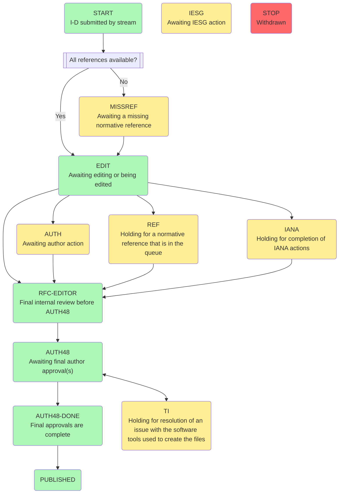

The RFC publication process includes the stages described below. See the process flowchart here.

RFC Submission Process
RFC Editing Process
Authors’ Final Review
Publication
Copyright Notice and Legend

# Process and state overview

# Submission of an I-D for publication as an RFC
Each publication stream has its own process for approving an I-D and submitting it for publication as an RFC.

* **IETF Stream**. I-Ds from the IETF stream are submitted by the IESG following their processes documented in ...

* **IAB Stream**, The process for publication of IAB RFCs is documented in RFC 4845.

* **IRTF Stream**. The process for publication of IRTF RFCs is documented in Section 3 of RFC 5743.

* **Independent Stream**. The process for publication of Independent Submission RFCs is documented in Section 3 of RFC 4846.

# RFC Editing Process
The RFC Editor maintains a list of documents in the editorial process. Since documents are processed in roughly FIFO order, this list is called the publication queue.

Each document in the queue is assigned to a state that tracks its progress. The state diagram shows the overall publication process.

Whenever a document enters the editorial queue, changes its state in the queue, or leaves the queue, an automatic email message summarizing the state change is sent to the authors. This message is for information only; it does not replace existing messages to authors, such as AUTH48 messages.

Here are the details of how we update your source file, and here are some important notes on the process.

- IANA processing generally takes place in parallel with editing, but occasionally a document can be held up a long time in IANA state (through no fault of IANA).
- A document A that has a normative reference to a document B that is not yet in the queue will be held at MISSREF state (perhaps a very long time) until B enters the queue. Once A and B are both in the queue, they will both be edited. For various reasons, this editing may require different times. A will be held in REF state, if necessary, until B’s editing is complete, so that A and B will enter the final quality-control state RFC-EDITOR, together. Collections of 5 or more documents linked by such normative references are not unusual.
- IETF working groups sometimes submit sets of documents that should be published together although they are not explicitly coupled by normative references. (Ideally, such document sets would be visible in the queue; we are working on that). A document that belongs to such an implicit set may be held (perhaps a long time) in RFC-EDITOR state, until the entire set has entered RFC-EDITOR state.
- Editing sometimes raises issues that lead to technical discussions involving the working group and an Area Director. If the delay is significant, the document is put into IESG state until the issue is resolved.
- A document may occasionally “fall out” of the queue at any time, e.g., because a working group, an author, or an Area Director requests that it be withdrawn.
 

# Authors’ Final Review (AUTH48 State)
Once an RFC has been edited and is ready for publication, the author(s) are given “48 hours” (in practice, this often stretches over weeks) to look over their document for errors, editorial and otherwise. We DO NOT make changes to RFCs once they have been published, so please look over your document carefully. Upon approval by all authors, the RFC will be published.

The AUTH48 notification message sent to authors asks that they review the entire document, paying particular attention to:

IANA considerations updates (if applicable),
contact information, and
references.
All AUTH48 messages will be CCed to auth48archive@rfc-editor.org, the archival mailing list that preserves the AUTH48 conversation. The auth48archive list is not an active discussion list.

Note: If absolutely necessary, authors may temporarily opt out of the archiving of messages (e.g., to discuss a sensitive matter). If opting out, authors should add a note to the top of the message that indicates the auth48archive@rfc-editor.org has been dropped. When the discussion is concluded, the archive will be re-added to the CC list and its addition will be noted at the top of the message.

See the general AUTH48 process described here.

If an author is no longer available, there are several options (as listed in the FAQ). Indefinite delays are not allowed, but when there is a choice, the RFC Editor would in general prefer to publish it right than to publish it early.

See the AUTH48 FAQ for more information.

# Publication
When an RFC is published, an announcement is sent to ietf-announce and rfc-dist mailing lists. The URL for the info page of an RFC is of the form: https://www.rfc-editor.org/info/rfcXXXX. The most recently published RFCs are listed here.

 